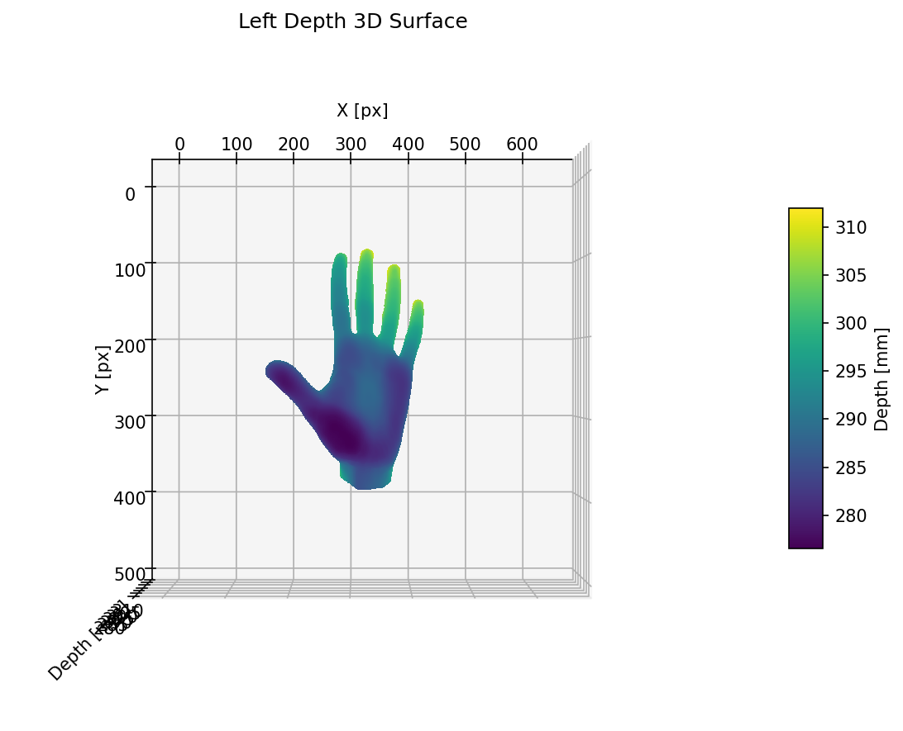
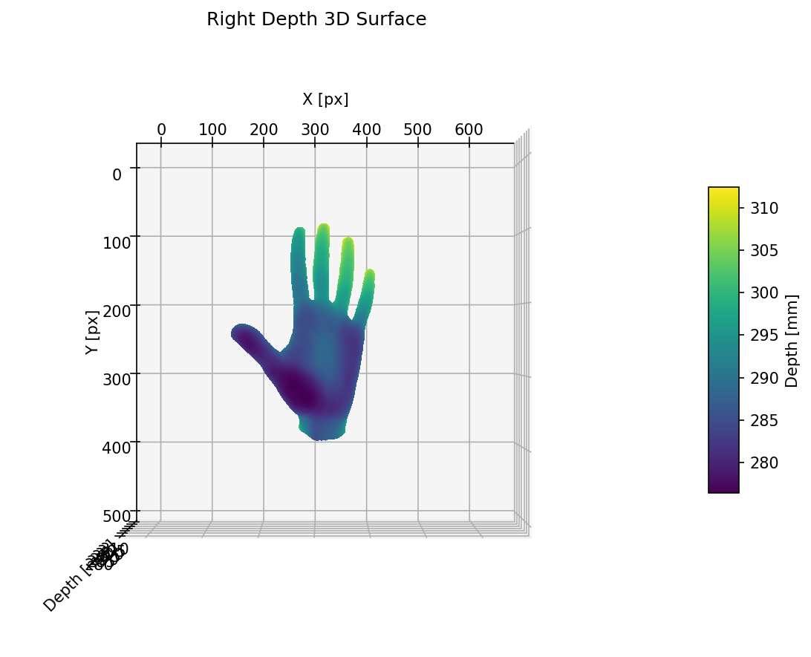

# SPARK – Stereo Projection and Accurate Reconstruction Kit

SPARK is a lightweight Python tool-chain for generating high-quality stereo RGB, depth and XYZ ground-truth images from a watertight mesh / point-cloud.  It relies only on [Open3D](https://www.open3d.org/) and NumPy and runs fully offline – perfect for synthetic dataset creation or algorithm evaluation.

---

## Features

* Off-screen, headless rendering via Open3D (no GUI required)
* Metric depth in **millimetres** (16-bit TIFF) + aligned RGB (PNG)
* Automatic computation of XYZ maps in world coordinates
* Reprojection helper to synthesise one view from the other and measure photometric error
* Single-command batch generation for multiple camera poses

Example images (from the *rotZ180* pose) are in `examples/pose_rotZ180/`:

| Left RGB | Right RGB |
| --- | --- |
|  |  |

| Recon Right (from Left) | Error map |
| --- | --- |
|  |  |

| Depth 3-D Surface (Left) | Depth 3-D Surface (Right) |
| --- | --- |
|  |  |

---

## Requirements

* Python 3.8+
* Open3D ≥ 0.15 (tested 0.19)
* NumPy, OpenCV-Python, tifffile, matplotlib

Install everything with:
```bash
python -m venv venv
source venv/bin/activate
pip install -r requirements.txt
```

---

## Usage

### 1. Quick interactive demo
Renders a single pose, shows the mesh in an Open3D viewer and pops up matplotlib windows with reconstructions and diff maps.
```bash
python src/demo_stereo_pipeline.py
```

### 2. Generate ground-truth datasets for multiple poses
`generate_gt_poses.py` currently defines two left-camera poses:
* `pose_default` – looking straight at the object
* `pose_rotZ180` – same position rotated 180 ° around the optical axis

Run:
```bash
python src/generate_gt_poses.py
```
Outputs are written to `output_poses/<pose_name>/`:
* `left.png`, `right.png` – 8-bit RGB
* `left_depth.tiff`, `right_depth.tiff` – 16-bit metric depth in mm
* `recon_*`, `diff_*` – reprojection checks
* `error.txt` – mean absolute colour error

Add more poses by editing the `poses` dict in the script.

---

## Licence

MIT Licence © 2025 Sergey Liflandsky – All rights reserved.
